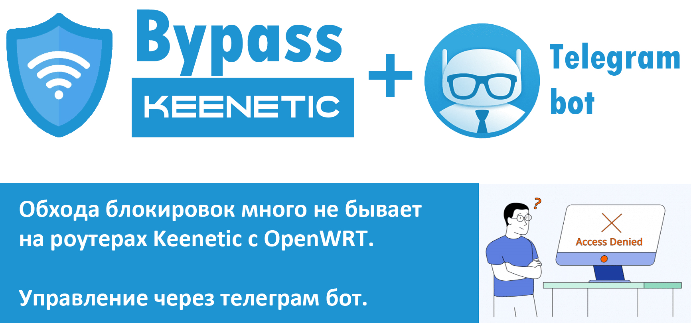

# bypass_keenetic

Установка обхода блокировок на роутерах Keenetic с установленной средой OpenWrt через телеграм бот.

## Что это и зачем
- [Полное описание читайте в вики](https://github.com/ziwork/bypass_keenetic/wiki)

## Установка 
- [Установка Entware](https://github.com/ziwork/bypass_keenetic/wiki/Install-Entware-and-Preparation)
- [Установка бота и скриптов](https://github.com/ziwork/bypass_keenetic/wiki/Install-bot-and-scripts)

## Как обновиться:
- [Обновление на новую версию](https://github.com/ziwork/bypass_keenetic/wiki/Update-bot-and-scripts)

## Если у вас версия 2.0
* `opkg update`
* `mv /opt/etc/bot.py /opt/etc/bot_old.py`
* `curl -o /opt/etc/bot.py https://raw.githubusercontent.com/ziwork/bypass_keenetic/main/bot.py`
* `bot_pid=$(ps | grep bot.py | awk '{print $1}')`
* `for bot in ${bot_pid}; do kill "${bot}"; done`
* `python3 /opt/etc/bot.py`
* Открыть бота в телеграм -> `/update`
* Наблюдать за процессом обновления. 🔭

> * **Бот перезагрузится сам, нужно просто немного подождать, секунд 30.**
> * **Для корректной работы, возможно потребуется перезагрузить роутер**, в меню бота `Сервис` -> `Перезагрузить роутер`
> * **ВАЖНО: Ключи, мосты, списки сайтов НЕ ПЕРЕЗАПИСЫВАЮТСЯ, в папке `/opt/root/backup-data` будут лежать файлы которые были заменены**

<!--
Полное описание:
https://habr.com/ru/post/669314/
-->

Поддержать проект:
* `ziwork aka NetworK`
* `4817 7603 0990 8527` Сбербанк VISA

* `tas-unn aka Masterland`
* `2204 1201 0098 8217` КАРТА МИР 
* `410017539693882` Юмани 
* `bc1qesjaxfad8f8azu2cp4gsvt2j9a4yshsc2swey9` Биткоин кошелёк
